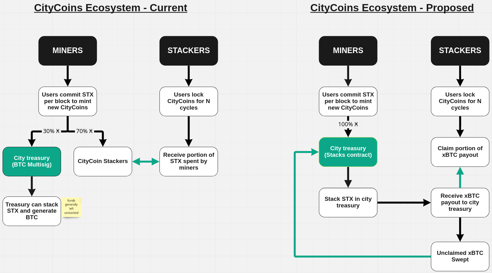

# CCIP-013

## Preamble

| CCIP Number   | 013                                              |
| ------------- | ------------------------------------------------ |
| Title         | Stabilize Protocol and Simplify Contracts        |
| Author(s)     | Jason Schrader jason@joinfreehold.com            |
|               | BowTiedMooneeb bowtiedmooneeb@gmail.com          |
|               | Ryan Waits ryan.waits@gmail.com                  |
| Consideration | Economic, Governance, Technical                  |
| Type          | Standard                                         |
| Status        | Draft                                            |
| Created       | 2022-08-15                                       |
| License       | BSD-2-Clause                                     |
| Replaces      | CCIP-001, CCIP-002, CCIP-003, CCIP-004, CCIP-010 |

## Introduction

This proposal implements the second of two changes to help stabilize the CityCoins protocol design, and allow for future development, experimentation, and growth.

Please see CCIP-012[^1] for the first part of the proposal.

This proposal is designed to work in concert with Phase 1 and 2 of CCIP-012[^1], and is divided into two phases:

- Phase 3: simplify the CityCoins contract design
- Phase 4: update registration, mining and stacking flows

Both phases help simplify the CityCoins protocol, and bring the ownership and execution of CityCoin contract updates into the DAO created in Phase 2 of CCIP-012[^1].

## Specification

### Phase 3: Simplify the CityCoins Contract Design

The original design allowed each city to grow and change independent of the core protocol specification, with the intent that each city would eventually manage their local deployment.

Under the current protocol, each city requires three smart contracts that cover three main areas:

- Auth: initialization and protected functions
- Core: user registration, activation, mining and stacking
- Token: SIP-010 functions, send-many support

This design choice prioritized customization at the city level but also led to some unforeseen challenges, including:

1. Inconsistencies between contract code being developed vs already deployed

   - v1.0.1 core contracts printed more information for mining/stacking[^2] [(image)](citycoins-version-differences-in-mine-many-function.png)
   - v1.0.1 token contracts allow the owner to burn tokens instead of the core contract[^3] [(image)](citycoins-version-differences-in-token-burn-function.png)
   - this caused testing strategies to diverge and become more complex over time

2. No universal identification for users, inconsistent user IDs

   - user IDs are generated and stored per user, per core contract
   - user IDs are not correlated or associated between contracts
   - a lookup against each contract is required to determine the user ID
   - e.g. for Stacks address `SP1FJ0MY8M18KZF43E85WJN48SDXYS1EC4BCQW02S`
     - MIA v1 User ID: 1137[^4]
     - MIA v2 User ID: 11[^5]
     - NYC v1 User ID: 682[^6]
     - NYC v2 User ID: 9[^7]

3. No universal registry for contracts, all upgrades are tracked on a city by city level

   - it is possible for contract code and standards to diverge, as seen with MIA/NYC
   - it is difficult to know what versions of contracts are deployed in each city
   - it is difficult to know which contract to query for what set of information

4. Mining and stacking data does not migrate after a core contract upgrade

   - each upgrade requires starting over with registration and activation
   - stacking cycles remain the same, but cycle data is not migrated
   - blocks can be missed due to the timing of shutdown, initialization, and registration

5. Testing model grows exponentially with new city additions

   - there are several custom functions and implementations across tests
   - differences in deployments / contract code require multiple saved versions
   - tooling has advanced quite a bit since we created this structure

In order to form a more cohesive protocol and consistent experience across all CityCoins, and to reduce the amount of overhead for protocol upgrades and maintenance, this could be simplified into a structure that takes advantage of the initial DAO created in Phase 2.

Using this DAO structure, proposals would be created and executed that:

- create a general registration contract for all CityCoins that would track:
  - user registration for all CityCoins
  - available cities and status (enabled/disabled)
  - treasury addresses for each city
- create a general mining contract for all CityCoins that would track:
  - mining stats per block, per city
  - mining stats per user, per block, per city
  - mining exchange rate for a city
  - mints new CityCoins to block winners
- create a general stacking contract for all CityCoins that would track:
  - stacking stats per cycle, per city
  - stacking stats per user, per cycle, per city
  - stacking total value locked per city
- adds MIA and NYC as activated cities under the new protocol

Any new cities activated following these changes would only require a token contract and the necessary treasury contracts, all of which could be decided upon and instantiated through DAO proposals.

### Phase 4: Update Registration, Mining and Stacking Flows

In addition to the overall protocol changes above, this phase implements a change to the value flows in mining and stacking, such that:

- 100% of STX spent mining CityCoins is transferred to the city’s treasury
- 100% of the STX within the city’s treasury are stacked for xBTC rewards
- 100% of the xBTC rewards are claimable by anyone who stacks CityCoins, such that:
  - rewards are distributed per cycle
  - rewards are distributed proportionally to the amount of CityCoins stacked
  - if they are not claimed within 2 cycles, they can be claimed by the DAO? (open for discussion)

This changes the value flow such that stacking rewards are no longer directly correlated to miner activity per cycle, and instead the stacking rewards are distributed based on the size of the city's treasury.

This would also make it so that CityCoin stacking cycles become closer aligned with Stacks stacking cycles and payouts.

## Backwards Compatibility

This CCIP affects and replaces several parts of the protocol, including:

- CCIP-001 Traits
- CCIP-002 Activation
- CCIP-003 Mining
- CCIP-004 Stacking
- CCIP-010 Auth v2

## Activation

This CCIP will be voted on using a vote contract that adheres to CCIP-011[^8] using the last two active cycles from when the contract is deployed.

## Reference Implementations

TODO: add vote contract

TODO: add new contract links

## Footnotes

[^1]: https://github.com/citycoins/governance/blob/feat/stabilize-protocol/ccips/ccip-012/ccip-012-stabilize-emissions-and-treasuries.md
[^2]: https://github.com/citycoins/contracts/compare/v1.0.0..v1.0.1#diff-e37948ac92ea9a8244dbe686a6e9d703310071e2f9a876462a3ebd68e6ea0640
[^3]: https://github.com/citycoins/contracts/compare/v1.0.0..v1.0.1#diff-6d232ce77a090ee867b911c855fd76a75db3c677b17576895b55550c6cf347b6
[^4]: https://api.citycoins.co/v1/mia/activation/get-user-id/SP1FJ0MY8M18KZF43E85WJN48SDXYS1EC4BCQW02S
[^5]: https://api.citycoins.co/v2/mia/activation/get-user-id/SP1FJ0MY8M18KZF43E85WJN48SDXYS1EC4BCQW02S
[^6]: https://api.citycoins.co/v1/nyc/activation/get-user-id/SP1FJ0MY8M18KZF43E85WJN48SDXYS1EC4BCQW02S
[^7]: https://api.citycoins.co/v2/nyc/activation/get-user-id/SP1FJ0MY8M18KZF43E85WJN48SDXYS1EC4BCQW02S
[^8]: https://github.com/citycoins/governance/blob/main/ccips/ccip-011/ccip-011-citycoins-stacked-tokens-voting.md
