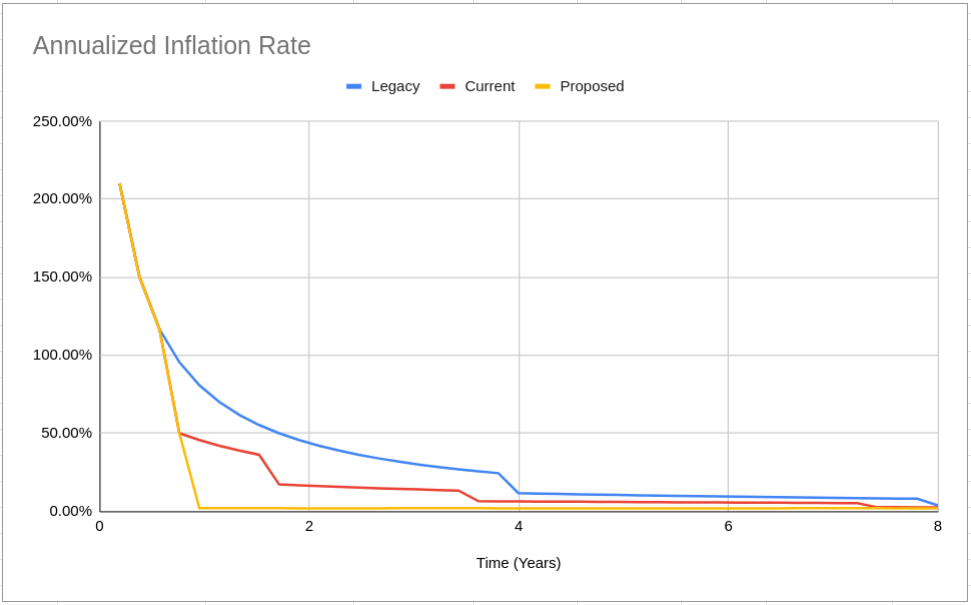

# CCIP-000

## Preamble

| CCIP Number   | TBD                                       |
| ------------- | ----------------------------------------- |
| Title         | Stabilize Protocol for Future Development |
| Author(s)     | Jason Schrader jason@joinfreehold.com     |
| Consideration | Economic, Governance, Technical           |
| Type          | Standard                                  |
| Status        | Draft                                     |
| Created       | 2022-08-04                                |
| License       | BSD-2-Clause                              |
| Replaces      | TBD                                       |

## Introduction

This proposal seeks to stabilize the CityCoins protocol to allow for future development in three phases.

- Phase 1: reduce current CityCoin emissions to 2%
- Phase 2: move treasuries to smart contract vaults
- Phase 3: stabilize and upgrade CityCoins protocol

## Specification

### Phase 1: Reduce CityCoin Emissions

Previously, the community successfully voted for and implemented CCIP-008 in April 2022[^1]. This change included a single iteration to test stemming the miner arbitrage problem, the results were mixed as the arbitrage volume was reduced, but is still persistent[^2].

Phase 1 change reduces inflation to 2% annually for existing CityCoins starting at Stacks block height 73,000, and works in concert with proposed changes described in Phase 2 and Phase 3 below.

To implement this change a proposal will be submitted to the auth contract for MIA/NYC, using the `update-coinbase-amounts` function defined in CCIP-010[^3].

The coinbase amounts will be updated based on the schedule described in the linked spreadsheet[^4], with a visual example of the reduction in total supply below:
)
(TODO: put finalized spreadsheet in ODS format)

| Blocks Passed | V1 Total Supply | V2 Total Supply | V3 Total Supply |
| ------------- | --------------- | --------------- | --------------- |
| 10,000        | 2,500,000,000   | 2,500,000,000   | 2,500,000,000   |
| 30,000        | 4,500,000,000   | 4,500,000,000   | 4,500,000,000   |
| 50,000        | 6,500,000,000   | 5,750,000,000   | 5,750,000,000   |
| 100,000       | 11,500,000,000  | 7,875,000,000   | 5,859,398,782   |
| 200,000       | 21,500,000,000  | 10,187,500,000  | 6,082,359,162   |
| 400,000       | 32,000,000,000  | 12,593,750,000  | 6,545,247,987   |
| 800,000       | 40,375,000,000  | 15,046,875,000  | 7,541,480,558   |

### Phase 2: Move CityCoin Treasuries to Smart Contract Vaults

Under the current protocol the treasuries for a CityCoin are stored in a 2-of-3 multi-signature Bitcoin wallet.

Bitcoin wallets possess the ability to make STX transfers and stack STX via Bitcoin transactions, but cannot interact with smart contracts.

This phase would replace the 2-of-3 multi-signature wallet with a smart contract vault secured by a DAO implementation that can grow with the protocol.

The basic structure of the DAO would start with:

- deploying the initial contract (similar to ExecutorDAO[^5]/StackerDAOs[^6]/EcosystemDAO[^7])
- setup with 3-of-5 signers from the auth contract
- enable proposals and temporary veto/execution

Using this DAO structure, two proposals would be created and executed:

- create treasuries for the existing cities
- stack treasuries for the existing cities

The structure of the DAO is very flexible and would provide an easy path to implementing features such as community proposals, community voting (via CCIP-011[^8] or a new method), as well as directly manage the protocol contracts through the DAO.

### Phase 3: Stabilize and Upgrade Protocol Contracts

This phase implements two main changes to help simplify the CityCoins protocol design, and bring ownership and execution of CityCoin contract updates into the DAO setup in Phase 2.

1. Stabilize the CityCoins Protocol
2. Update Registration, Mining and Stacking flows

#### Simplify the CityCoins Protocol

The original design allowed each city to grow and change independent of the core protocol specification, with the intent that each city would eventually manage their local deployment.

Under the current protocol, each city requires three smart contracts that cover three main areas:

- Auth: initialization and protected functions
- Core: user registration, activation, mining and stacking
- Token: SIP-010 functions, send-many support

This design choice prioritized customization at the city level but also led to some unforeseen challenges, including:

- inconsistencies between contract code being developed vs already deployed (TODO: link to diff between v1 MIA and v1.1 NYC)
- no universal identification for users, instead one user ID per core contract (TODO: show example of v1 vs v2 MIA and NYC IDs)
- mining and stacking data does not migrate after a core contract upgrade
- no universal registry for contracts, all upgrades are tracked on a city by city level
- an unsustainable unit testing model that grows exponentially with new cities (TODO: example of 900+ tests run on GitHub)

In order to form a more cohesive protocol and consistent experience across all CityCoins, and to reduce the amount of overhead for protocol upgrades and maintenance, this could be simplified into a structure that takes advantage of the initial DAO created in Phase 2.

Using this DAO structure, proposals would be created and executed that:

- create a general registration contract for all CityCoins that would track:
  - user registration for all CityCoins
  - available cities and status (enabled/disabled)
  - treasury addresses for each city
- create a general mining contract for all CityCoins that would track:
  - mining stats per block, per city
  - mining stats per user, per block, per city
  - mining exchange rate for a city
  - mints new CityCoins to block winners
- create a general stacking contract for all CityCoins that would track:
  - stacking stats per cycle, per city
  - stacking stats per user, per cycle, per city
  - stacking total value locked per city
- adds MIA and NYC as activated cities under the new protocol

Any new cities activated following these changes would only require a token contract and the necessary treasury contracts, all of which could be decided upon and instantiated through DAO proposals.

#### Update Mining and Stacking flows

In addition to the overall protocol changes above, this phase implements a change to the value flows in mining and stacking, such that:

- 100% of STX spent mining CityCoins is transferred to the city’s treasury
- the STX within the city’s treasury are stacked for xBTC
- a portion of xBTC rewards can be claimed by CityCoin Stackers who participate by locking their CityCoins for a reward cycle

This change would make it so that CityCoin stacking cycles become dependent on Stacks stacking cycles.

## Backwards Compatibility

This CCIP affects and replaces several parts of the protocol, including:

- CCIP-001 Traits
- CCIP-002 Activation
- CCIP-003 Mining
- CCIP-004 Stacking
- CCIP-008 Token v2
- CCIP-010 Auth v2

## Activation

This CCIP will be voted on using a vote contract that adheres to CCIP-011[^8].

## Reference Implementations

TBD

## Footnotes

[^1]: https://vote.minecitycoins.com/
[^2]: https://docs.google.com/spreadsheets/d/1d3IPNPENA1GOVFCB25tehUw14t_y4yzpU0X3euoCmUc/edit#gid=148425312
[^3]: https://github.com/citycoins/governance/blob/main/ccips/ccip-010/ccip-010-citycoins-auth-v2.md
[^4]: https://docs.google.com/spreadsheets/u/1/d/17aF6LlniJ3Bk3YomDynOHRrx4vxiyotplD42hUbiSRA/edit#gid=1451657949
[^5]: https://github.com/MarvinJanssen/executor-dao
[^6]: https://github.com/StackerDAOs/backend
[^7]: https://github.com/Clarity-Innovation-Lab/ecosystem-dao
[^8]: https://github.com/citycoins/governance/blob/main/ccips/ccip-011/ccip-011-citycoins-stacked-tokens-voting.md
